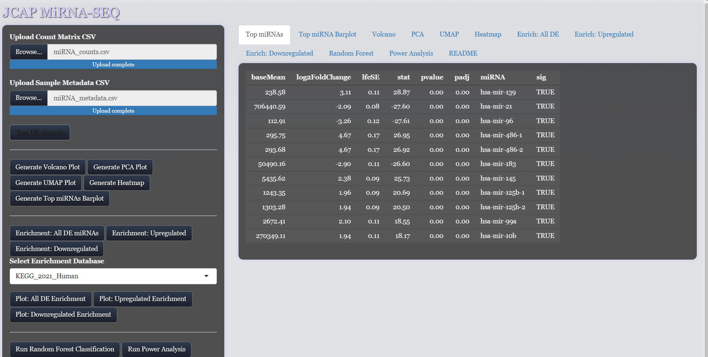
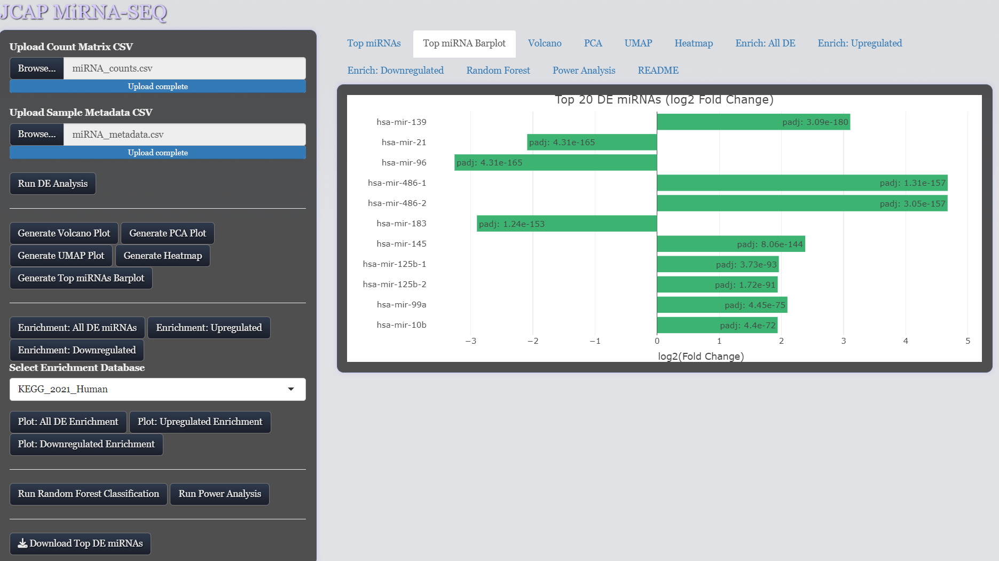

# 🧬 miRNA Differential Expression & Enrichment App

This interactive Shiny application allows users to perform and explore **differential expression analysis of miRNA-seq data** using DESeq2, visualize results through various dimensionality reduction and plotting tools, perform **functional enrichment**, run **Random Forest classification**, and conduct **power analysis** to support experimental design.

---

## ✨ Features

- 📈 DESeq2-based differential expression analysis
- 🌋 Volcano plot, PCA, UMAP, heatmaps, and barplots
- 🧠 Functional enrichment (Enrichr & clusterProfiler fallback)
- 🌲 Random Forest classification with AUC, sensitivity, and feature importance
- 🔋 Power analysis for sample size estimation across miRNAs
- 💾 Exportable tables and plots
- 📖 Built-in README tab for user guidance
- 🧊 Optional custom styling via `www/styles.css`

---

## 🖼️ Screenshots

### Differential Expression Table


### Top miRNA Bar Plot


---

## 🛠️ Tech Stack

| Layer              | Tool/Library            |
|-------------------|-------------------------|
| Language           | R (≥ 4.0.0)             |
| Frontend           | Shiny, Plotly, DT       |
| DE Analysis        | DESeq2                  |
| Enrichment         | enrichR, clusterProfiler, org.Hs.eg.db |
| ML Classification  | randomForest, pROC      |
| Power Analysis     | pwr                     |
| Containerization   | Docker, Singularity/Apptainer |
| Styling            | Custom CSS              |

---

## 🚀 Installation

### 📦 Prerequisites

- [R (≥ 4.0)](https://www.r-project.org/)
- Required R packages: `shiny`, `DESeq2`, `ggplot2`, `dplyr`, `plotly`, `umap`, `pheatmap`, `enrichR`, `clusterProfiler`, `org.Hs.eg.db`, `randomForest`, `pROC`, `pwr`, `DT`
- Either:
  - [Docker](https://docs.docker.com/)
  - or [Apptainer/Singularity](https://apptainer.org/)
- Optional: RStudio for local development

---

## 📂 Folder Structure

mi_rna_shiny_deploy/
├── app/
│ ├── app.R
│ ├── data/
│ │ └── mirna_targets.csv
│ ├── www/
│ │ └── styles.css
│ └── readme.txt
├── Dockerfile
├── Singularity.def
├── miRNA_shiny.sif # Built container image
├── launch_shiny.sbatch # SLURM job script
├── logs/ # Output from SLURM jobs
└── screenshots/ # PNGs for README or demos

---

## 💻 Local Use (in R/RStudio)

```r
shiny::runApp("app")


🧬 Singularity / Apptainer Deployment (HPC)
Step 1: Build the container

in bash
apptainer build miRNA_shiny.sif Singularity.def

Step 2: Submit to SLURM
in bash

sbatch launch_shiny.sbatch

then  📡 Tunnel to the HPC port to access the app:
ssh -N -L 3838:localhost:3838 your_user@hpc.domain.edu

Then open: http://localhost:3838
📖 Example Input Files
Counts File: CSV file (rows = miRNAs, columns = samples)

Metadata File: CSV file (first column = sample IDs, last column = condition)

Sample data is provided under mi_rna_data

🧠 Credits
Built with ❤️ and R to make bioinformatics more accessible, interactive, and powerful.


